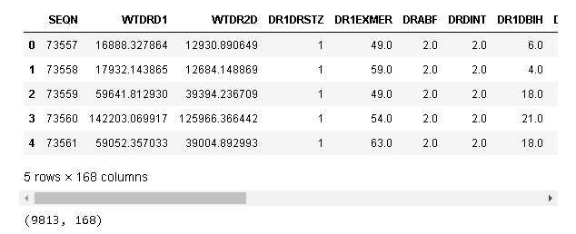
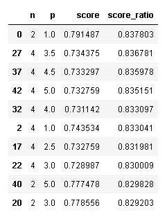
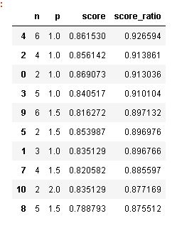
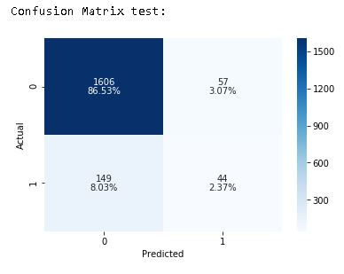

### Predicting Diabetes using dietary information

<a href="https://www.kaggle.com/cdc/national-health-and-nutrition-examination-survey">Data Source</a>  
<a href="https://youtu.be/GQKXZvqVS14">Presentation Video</a>  
<a href="https://medium.com/@cheffrey2000/data-science-data-not-science-f670c31242aa?source=friends_link&sk=805f34b7e233f79f88e10453a2d9f820">Blog Post</a>  
<a href="https://docs.google.com/presentation/d/1uwT3q4xS26hub2sBi-drLQfemYQ5MTH9B7JOZ0y2dJI/edit?usp=sharing">Presentation Slide Deck</a>  

#### Using the data from The National Health and Nutrition Survey, we will attempt to predict a Diabetes diagnosis from the detailed dietary information obtained through interviews.

## Data cleaning

#### The first task with this data set is to combine the two files which contain the information we need for the analysis.  
- The first file "diet" contains answers to questions about dietary habits.
- The second file "questionnaire"  has information about the resopondents health conditions including whether or not they have been diagnosed with diabetes or not.

#### The two files will be joined using the common column "seqn" which is the unique identifier for each respondent.

#### The resulting dataframe is below.
- the shape is below and consists of 168 features and 9813 instances.

#### Many of the columns are not necessary for our analysis, so they were dropped.
- __'SEQN1'__ is the same as __'SEQN'__ and is not necessary after the join
- __'DR1EXMER'__ is an identifier for the interviewer
- __'DR1DBIH'__ is the number of days elapsed between the exam and interview
- __'DR1LANG'__ is the language used by the respondent for the interview
- __'DR1MNRSP'__ is the person who answered the questions, subject or caretaker
- __'DR1HELPD'__ identifies who helped answer the questions, if anyone

#### There were a pretty good amount of NaN values, so they were handled using the Pandas function `fillna()`
- Other than the NaN values, the dataset was clean with the exception of some placeholders which were cleaned up using a custom function called `fix_placeholder`

#### The target, DIQ010 has multiple values.  The following values were dropped:  
- refused  
- didn't know  
- missing  

The borderline responses were combined with the yes responses to treat them as a confirmed diagnosis for this analysis.

#### After cleaning and organizing, the cleaned data was saved to a new file, "DIQ010_Target.csv"

## Modeling

#### A first look at the data revealed that it is unbalanced.  
- We used SMOTE to balance it out for analysis.

#### Once the data was loaded, and a preliminary model was run, it was discovered that the _'id'_ column was causing leaked data.  
- This column was removed.

### Modeling
- RandomForestClassifier

This classifier is optimizing for precision and was not yielding the desired results.

#### Using GridSearchCV we will try all combinations of a few hyperparameters.
- _n_estimators_
    - Using 10, 20, 50, and 100
- _criterion_
    - entropy and gini
- _max_depth_
    - 1, 2, 5, and 10
- _min_samples_split_
    - 0, 1, 2, and 3

Using the best_params_ function we retrieved the following results:
- criterion': 'gini',
- max_depth': 1,
- min_samples_split': 2,
- n_estimators': 10

#### The resulting model was a little more promising as seen below.

over 25% are being labeled as false positives, so we will try other classifiers.

#### Next we tried KNN classifier
- The first step was to use a for loop to test some parameter combinations and find the best combination.

#### In an attempt to improve the performance of the model, we scaled the data using Sklearn's StandardScaler function.
- This gave us the following improved results.

#### This resulted in some acceptable model results, as seen in the confusion matrix below.

#### Next we attempted another classifier, a Support Vector Machine, the results are illustrated below.

#### This is the best performing model so far and it has acceptable results.

## Conclusion:

